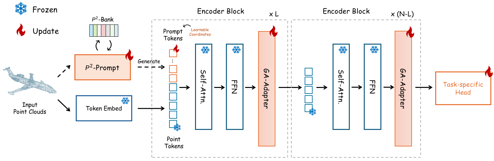

# Point-PEFT: Parameter-Efficient Fine-Tuning for 3D Pre-trained Models

Official implementation of ['Point-PEFT: Parameter-Efficient Fine-Tuning for 3D Pre-trained Models']().

## News
* 📣 We release the code of Point-M2AE with Point-PEFT on ScanObjectNN.

## Introduction

Comparison with existing 3D pre-trained models on the PB-T50-RS spilt of ScanObjectNN:
| Method | Parameters | PB-T50-RS|
| :-----: | :-----: |:-----:|
| [Point-BERT](https://github.com/lulutang0608/Point-BERT) | 22.1M | 83.1 %| 
| **With Point-PEFT** | **0.6M** | **85.0%**|
| [Point-MAE](https://github.com/Pang-Yatian/Point-MAE) | 22.1M | 85.2%|
| **With Point-PEFT** | **0.7M** | **85.5%**|
| **Point-MAE-aug** | **22.1M** | **88.1%**|
| **With Point-PEFT** | **0.7M** | **89.1%**|
| [Point-M2AE](https://github.com/ZrrSkywalker/Point-M2AE)| 12.9M | 86.4%|
| **With Point-PEFT** | **0.7M** | **86.4%**|
| **Point-M2AE-aug** | **12.9M** | **88.1%**|
| **With Point-PEFT** | **0.7M** | **88.2%**|

Comparison with existing 3D pre-trained models on the ModelNet40 without voting method:
| Method | Parameters | Acc|
| :-----: | :-----: |:-----:|
| [Point-BERT](https://github.com/lulutang0608/Point-BERT) | 22.1M | 92.7 %| 
| **With Point-PEFT** | **0.6M** | **93.4%**|
| [Point-MAE](https://github.com/Pang-Yatian/Point-MAE) | 22.1M | 93.2%|
| **With Point-PEFT** | **0.8M** | **94.2%**|
| [Point-M2AE](https://github.com/ZrrSkywalker/Point-M2AE)| 15.3M | 93.4%|
| **With Point-PEFT** | **0.6M** | **94.1%**|

We propose the Point-PEFT, a novel framework for adapting point cloud pre-trained models with minimal learnable parameters. Specifically, for a pre-trained 3D model, we freeze most of its parameters, and only tune the newly added PEFT modules on downstream tasks, which consist of a Point-prior Prompt and a Geometry-aware Adapter. The Point-prior Prompt adopts a set of learnable prompt tokens, for which we propose to construct a memory bank with domain-specific knowledge, and utilize a parameter-free attention to enhance the prompt tokens. The Geometry-aware Adapter aims to aggregate point cloud features within spatial neighborhoods to capture fine-grained geometric information through local interactions.

<div align="center">
  
</div>

## Point-PEFT

### the result of Fine-tuning

Real-world shape classification on the PB-T50-RS split of ScanObjectNN:
| Method | Config | Acc.| Logs |
| :-----: | :-----:|:-----:| :-----:|
| Point-M2AE-aug | [scan.yaml]() | 88.2% | [scan_m2ae.log]() |


## Requirements

### Installation
Create a conda environment and install basic dependencies:
```bash
git clone https://github.com/EvenJoker/Point-PEFT.git
cd Point-PEFT

conda create -n point-peft python=3.8
conda activate point-peft

# Install the according versions of torch and torchvision
conda install pytorch torchvision cudatoolkit
# e.g., conda install pytorch==1.11.0 torchvision==0.12.0 torchaudio==0.11.0 cudatoolkit=11.3

pip install -r requirements.txt
```
Install GPU-related packages:
```bash
# Chamfer Distance and EMD
cd ./extensions/chamfer_dist
python setup.py install --user
cd ../emd
python setup.py install --user

# PointNet++
pip install "git+https://github.com/erikwijmans/Pointnet2_PyTorch.git#egg=pointnet2_ops&subdirectory=pointnet2_ops_lib"

# GPU kNN
pip install --upgrade https://github.com/unlimblue/KNN_CUDA/releases/download/0.2/KNN_CUDA-0.2-py3-none-any.whl
```
### Datasets
For pre-training and fine-tuning, please follow [DATASET.md](https://github.com/lulutang0608/Point-BERT/blob/master/DATASET.md) to install ShapeNet, ModelNet40, ScanObjectNN, and ShapeNetPart datasets, referring to Point-BERT. Specially for Linear SVM evaluation, download the official [ModelNet40](https://shapenet.cs.stanford.edu/media/modelnet40_ply_hdf5_2048.zip) dataset and put the unzip folder under `data/`.

The final directory structure should be:
```
│Point-PEFT/
├──cfgs/
├──datasets/
├──data/
│   ├──ModelNet/
│   ├──ScanObjectNN/
├──...
```

## Get Started

### Fine-tuning
Please download the [ckpt-best.pth](), [pre-train.pth]() and [cache_shape.pt]() into the `ckpts/` folder. 

For the PB-T50-RS split of ScanObjectNN, run:
```bash
sh Finetune_cache_prompt_scan.sh
```

## Acknowledgement
This repo benefits from [Point-M2AE](https://github.com/ZrrSkywalker/Point-M2AE), [Point-BERT](https://github.com/lulutang0608/Point-BERT), [Point-MAE](https://github.com/Pang-Yatian/Point-MAE). Thanks for their wonderful works.

